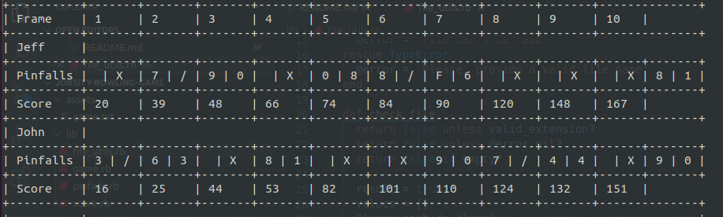

<h1 align="center">Bowling app</h1>

## about bowling game
Bowling app is a game that reads a file with the player's pinfalls and calculates the total score for it. When the player hits a strike it sums the next two points to the total. When the player hits a spare it sums the next point to the total.
Built with Ruby and tested with RSpec. The output was formatted using terminal-table gem package.

## about the project
The game has a basic interface that runs in the terminal.

The goals of this project are:

- Practice with OOP (Object Oriented Programming) using Ruby.
- Learn how to create and structure a Ruby project.
- Learn to manage the files with correct usage to make code maintainable.
- Practice Git Flow and Github Flow creating branches for different features and for version control.

## Setup

To get a local copy up and running follow these simple example steps.

## prerequisites
Computer running Mac OS, Windows, or Linux Ubuntu.
Internet browser: Firefox, Google Chrome, Opera...

Have Ruby installed you can see this link for more detailed instructions [Install Ruby](https://www.ruby-lang.org/en/documentation/installation/)

### installation

You MUST have Ruby installed in your system. If you don't have it installed you can go this page [Install Ruby](https://www.ruby-lang.org/en/documentation/installation/)

You should have Git installed. [Install Git](https://git-scm.com/downloads)

After installing ruby, you can download the repo or clone it (paste on the terminal) 
`git clone git@github.com:marcelomaidden/jobsity-bowling-game.git`
then change to the project directory 
`cd jobsity-bowling-game`
Finally install the necessary packages by typing the command below:

  `bundle install`

## run bowling game
You will need to execute the main file located inside the root folder inside the project. 
An example of file is available inside the assets folder with a basic two player game.
`ruby main.rb assets/game.txt`

## how to test

In order to test our project type the command below:

  rspec --format documentation

## 👥 author

👤**Marcelo Araújo**

- GitHub: [@marcelomaidden](https://github.com/marcelomaidden)
- Twitter: [@marcelomaidden](https://twitter.com/marcelomaidden)
- LinkedIn: [Marcelo Fernandes de Araújo](https://www.linkedin.com/in/marcelo-fernandes-de-ara%C3%BAjo-56700a171/)

## 🤝 contributing

Contributions, issues, and feature requests are welcome!

Feel free to check the [issues page](https://github.com/marcelomaidden/jobsity-bowling-game/issues).

## show-your-support

Give a ⭐️ if you like this project!
